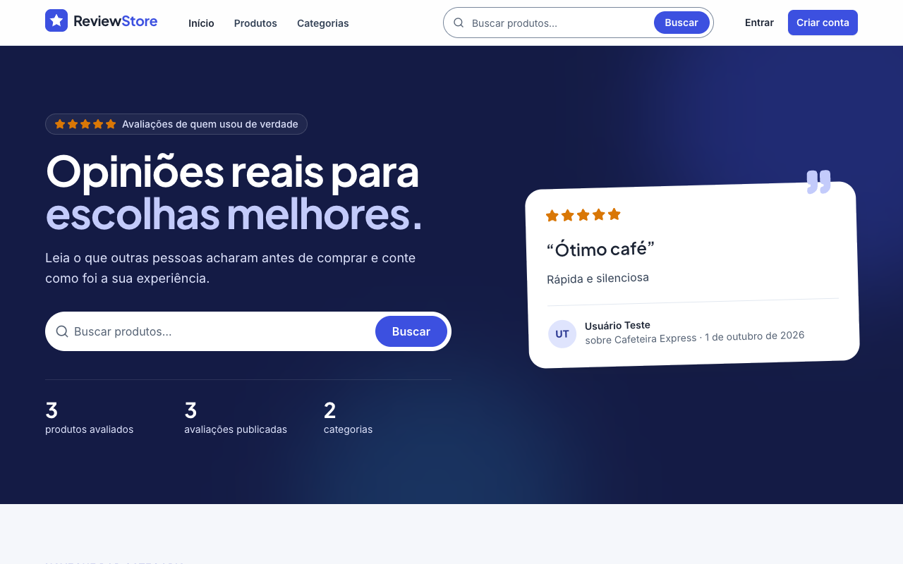
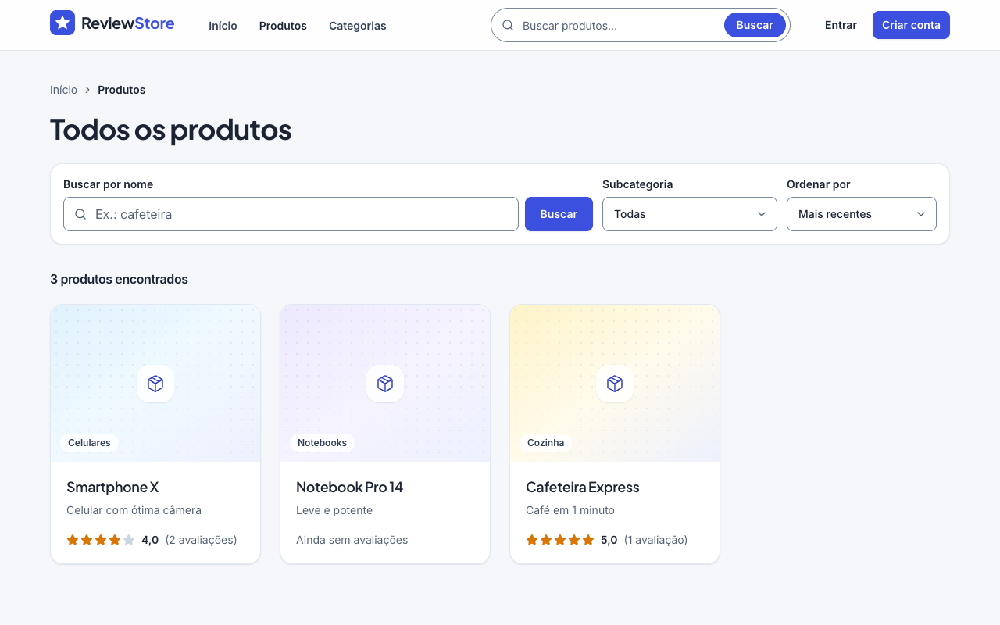
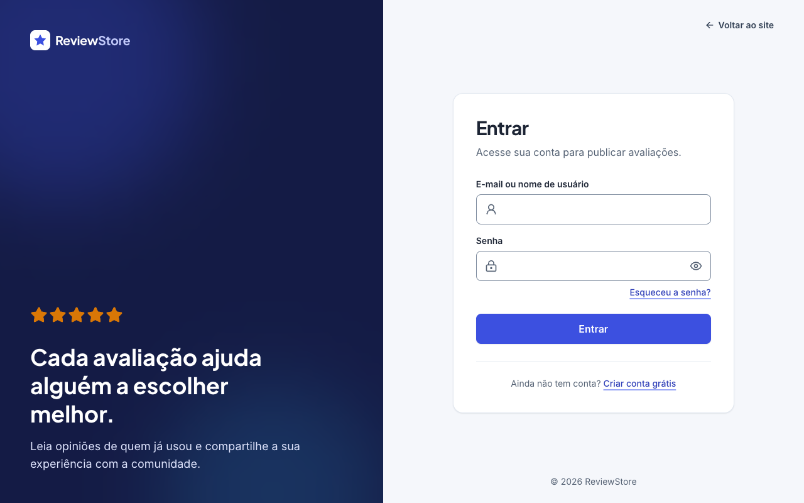
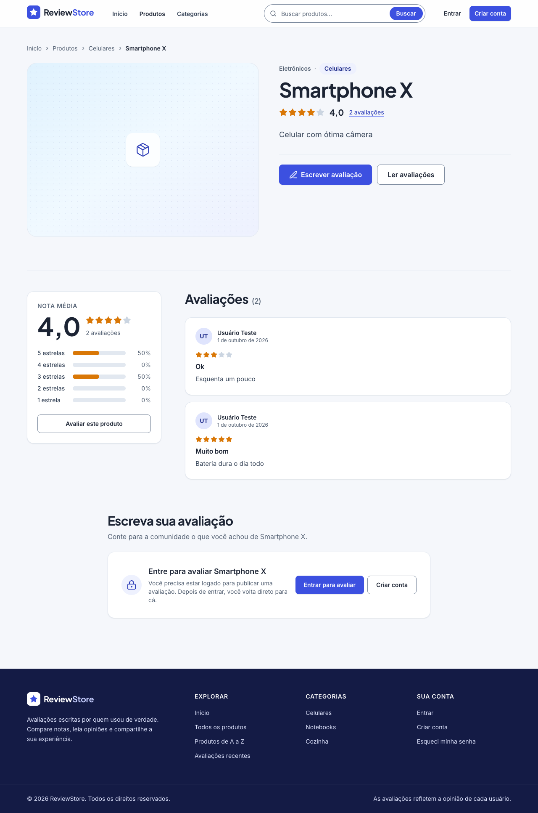
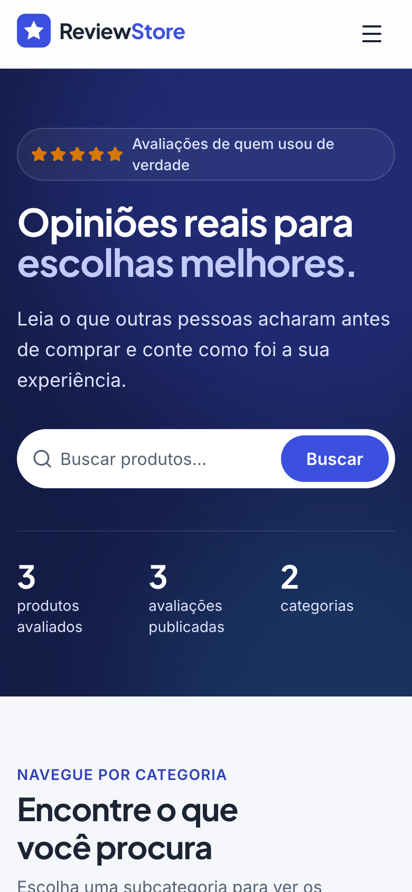
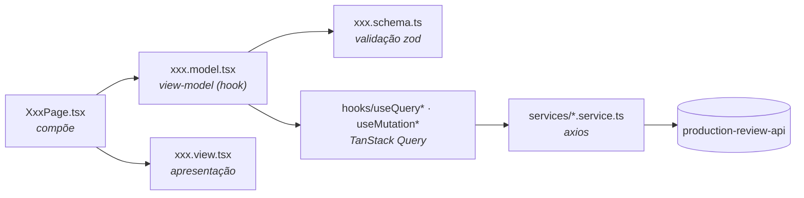

<div align="center">


# ReviewStore

**Avaliações reais de quem usou de verdade.**
Site público do ecossistema _Production Review_: compare produtos, veja notas e compartilhe sua experiência.

<p>
  
  
  
  
</p>
<p>
  
  
  
  
</p>

[Funcionalidades](#-funcionalidades) ·
[Telas](#-telas) ·
[Como rodar](#-como-rodar) ·
[Arquitetura](#-arquitetura) ·
[Acessibilidade](#-acessibilidade) ·
[Design system](#-design-system)

</div>

<br />

<p align="center">
  
</p>

---

## ✨ Funcionalidades

| | |
|---|---|
| 🔎 **Busca e catálogo** | Busca por nome, filtro por subcategoria, ordenação e paginação, tudo refletido na URL. |
| ⭐ **Notas da comunidade** | Nota média, total e distribuição de 1 a 5 estrelas em cada produto. |
| ✍️ **Avaliações** | Usuários logados publicam avaliações com título, comentário e nota. A lista e o resumo atualizam sozinhos. |
| 🧭 **Navegação por categorias** | Categorias e subcategorias direto na home e no rodapé. |
| 🔐 **Conta completa** | Cadastro, ativação por e-mail, login (usuário ou e-mail), recuperação de senha com código de 6 dígitos e logout. |
| ↩️ **Volta para onde parou** | Depois do login, o usuário retorna para a página de origem (inclusive para o formulário de avaliação). |
| 📱 **Responsivo** | De 360 px a telas grandes, com menu mobile acessível. |
| ♿ **Acessível** | Pensado para teclado e leitores de tela desde o início (veja [Acessibilidade](#-acessibilidade)). |

## 🖼 Telas

<table>
  <tr>
    <td width="50%"></td>
    <td width="50%"></td>
  </tr>
  <tr>
    <td align="center"><sub><b>Catálogo</b>: busca, filtros e notas</sub></td>
    <td align="center"><sub><b>Login</b>: usuário ou e-mail</sub></td>
  </tr>
</table>

<table>
  <tr>
    <td width="68%"></td>
    <td width="32%" valign="top"></td>
  </tr>
  <tr>
    <td align="center"><sub><b>Produto</b>: nota, distribuição e avaliações</sub></td>
    <td align="center"><sub><b>Mobile</b></sub></td>
  </tr>
</table>

## 🚀 Como rodar

### Pré-requisitos

- **Node.js 20+** e npm
- A API [`production-review-api`](https://github.com/erikomis/production-review-api) rodando (por padrão em `http://localhost:8084`)

### Passo a passo

```bash
# 1. Instale as dependências
npm install

# 2. Aponte para a API
echo "VITE_API_URL=http://localhost:8084/api/v1" > .env.local

# 3. Suba em modo de desenvolvimento (http://localhost:5174)
npm run dev
```

> [!IMPORTANT]
> A API usa cookies `httpOnly` para a sessão. Adicione a origem do site (`http://localhost:5174`) à variável `ALLOWED_ORIGINS` da API, senão o navegador bloqueia as requisições por CORS.

### Scripts

| Comando | O que faz |
|---|---|
| `npm run dev` | Servidor de desenvolvimento com HMR na porta **5174** |
| `npm run build` | Checagem de tipos (`tsc -b`) + build de produção em `dist/` |
| `npm run preview` | Serve o build de produção localmente |
| `npm run lint` | ESLint em todo o projeto |

### Variáveis de ambiente

| Variável | Exemplo | Descrição |
|---|---|---|
| `VITE_API_URL` | `http://localhost:8084/api/v1` | URL base da API, incluindo `/api/v1` |

## 🏛 Arquitetura

O projeto segue **MVVM** por tela. A view é só apresentação; toda a lógica fica no _view-model_ (um hook), que conversa com a API por meio de hooks do React Query e services.



```tsx
// Toda tela segue o mesmo formato
const ProductDetailPage = () => {
  const methods = useProductDetailModel(); // lógica, estado, queries e handlers
  return <ProductDetailView {...methods} />; // só apresentação
};
```

<details>
<summary><b>📁 Estrutura de pastas</b></summary>

```text
src/
├── environment/            # configuração por ambiente (URL da API)
├── modules/
│   ├── auth/               # login, cadastro, ativação, esqueci/redefinir senha
│   │   ├── sign-in/        #   SignInPage · sign-in.model · sign-in.view · schema · type
│   │   ├── ...
│   │   ├── hooks/          #   mutations de autenticação
│   │   └── services/       #   chamadas /auth/*
│   └── site/
│       ├── components/     # ProductCard, StarRating, RatingBreakdown, Pagination...
│       ├── layout/         # cabeçalho, rodapé e busca (também em MVVM)
│       ├── hooks/          # queries de produtos, categorias e avaliações
│       ├── services/       # chamadas /production, /category, /review
│       └── view/           # home, product-list, product-detail (+ create-review)
├── shared/                 # componentes, hooks, tipos e utilitários reutilizáveis
└── router.tsx              # rotas (TanStack Router) com loaders
```

</details>

### Integração com a API

| Recurso | Endpoint |
|---|---|
| Produtos (busca, ordenação, paginação) | `GET /production/list?page&size&search&property&sort` |
| Produto pelo slug | `GET /production/slug/{slug}` |
| Avaliações de um produto | `GET /review/product/{id}?page&size` |
| Resumo das notas | `GET /review/product/{id}/summary` |
| Avaliações recentes | `GET /review/list?size=6` |
| Publicar avaliação | `POST /review/` |
| Categorias e subcategorias | `GET /category/list` |
| Sessão | `POST /auth/sign-in` · `POST /auth/logout` · `GET /user/me` |

## ♿ Acessibilidade

Construído para atender **WCAG 2.1 nível AA**:

- **Estrutura semântica**: `header`, `nav` rotulados, `main` e `footer`, com títulos em ordem e o link **"Pular para o conteúdo"**.
- **Navegação por rota**: o título da aba muda a cada página e o foco vai para o conteúdo principal (ou para a âncora, como `#avaliar`).
- **Teclado**: foco sempre visível (contorno de 3 px), alvos de pelo menos 44 px, menus que fecham com <kbd>Esc</kbd> e devolvem o foco.
- **Formulários**: todo campo tem `label`; erros ficam ligados por `aria-describedby` + `aria-invalid`, e mensagens da API usam `role="alert"`.
- **Nota em estrelas**: na entrada, é um grupo de rádios nativo (as setas trocam a nota e cada opção é anunciada como _"3 de 5 estrelas"_); na exibição, tem texto alternativo como _"Nota 4,0 de 5 estrelas"_.
- **Feedback assíncrono**: `aria-live` no envio de avaliação e na contagem de resultados.
- **Movimento e contraste**: respeita `prefers-reduced-motion`; todos os textos passam de 4,5:1 de contraste (verificado por script).

## 🎨 Design system

Identidade compartilhada com o [painel administrativo](https://github.com/erikomis/dashboard-production-review-react): mesma marca, paleta e tipografia.

| Token | Cor | Uso |
|---|---|---|
| `brand-600` / `primary` |  | Botões, links e marca |
| `brand-950` |  | Hero e rodapé |
| `ink` |  | Texto principal |
| `muted` |  | Texto auxiliar |
| `canvas` |  | Fundo da página |
| `star` |  | Estrelas das avaliações |

**Tipografia:** [Plus Jakarta Sans](https://fonts.google.com/specimen/Plus+Jakarta+Sans) nos títulos e [Inter](https://fonts.google.com/specimen/Inter) no texto.

## 🧩 Ecossistema Production Review

| Projeto | Descrição |
|---|---|
| [**production-review-api**](https://github.com/erikomis/production-review-api) | API REST em Spring Boot: autenticação, catálogo e avaliações |
| [**dashboard-production-review-site**](https://github.com/erikomis/dashboard-production-review-site) | Este repositório: site público onde as pessoas avaliam produtos |
| [**dashboard-production-review-react**](https://github.com/erikomis/dashboard-production-review-react) | Painel administrativo do catálogo e das avaliações |

<div align="center">
<br />
<sub>Feito com ☕ e TypeScript.</sub>
</div>
